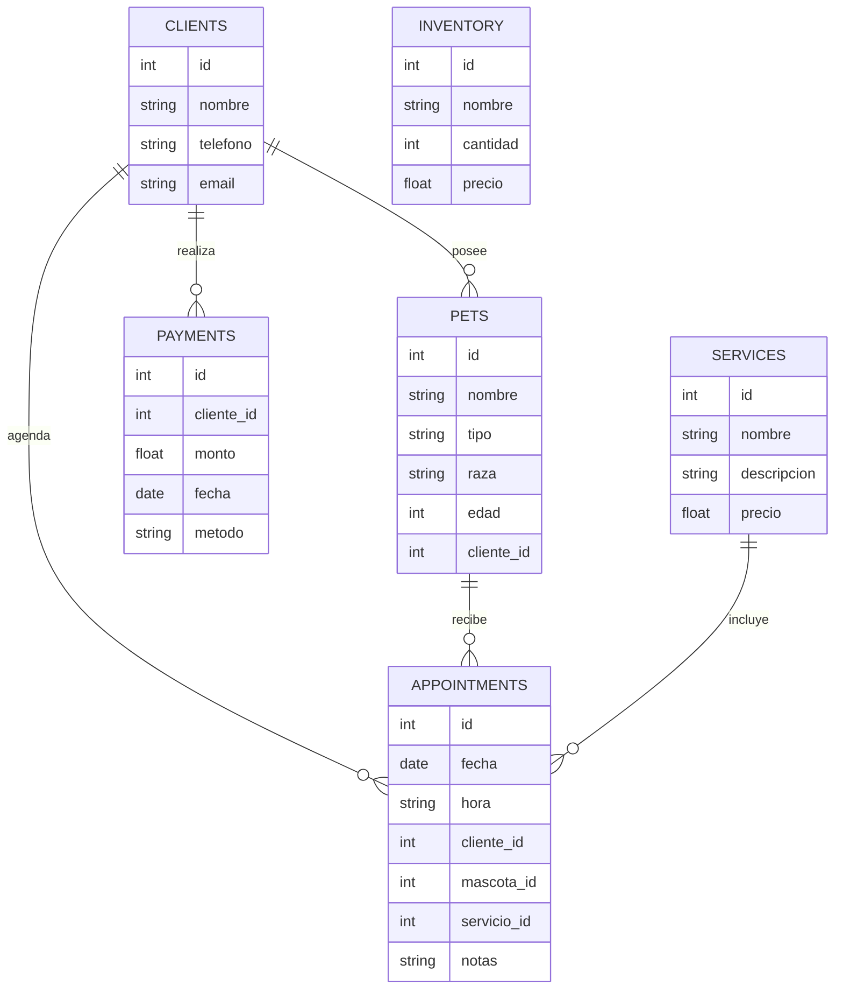

# CaniVet

## Nombre del Proyecto
CaniVet

## Descripcion del Proyecto
CaniVet es un sistema web de gestion veterinaria diseñado para administrar clientes, mascotas, citas, servicios, pagos, inventario y reportes desde una interfaz moderna. El proyecto combina un frontend en React con un backend en Flask y utiliza Supabase para autenticacion y almacenamiento de datos.

## Tecnologias Utilizadas
- React
- Vite
- JavaScript
- Flask
- Python
- Supabase
- Chart.js
- CSS

## Caracteristicas del Sistema
- Registro e inicio de sesion de usuarios
- Panel administrativo protegido
- Dashboard con resumen general
- CRUD de clientes
- CRUD de mascotas
- CRUD de citas
- CRUD de servicios
- CRUD de pagos
- CRUD de inventario
- Reportes exportables
- Filtros de datos
- Gestion de sucursales
- Historial clinico y vacunas por mascota
- Formulario de contacto con soporte para correo SMTP

## Requisitos del Sistema
- Node.js 18 o superior
- npm
- Python 3.10 o superior
- Entorno virtual de Python
- Proyecto de Supabase configurado
- Navegador web moderno

## Instalacion del Proyecto

### Clonar el repositorio de GitHub
```bash
git clone <URL_DEL_REPOSITORIO>
cd canivet
```

### Instalar dependencias del frontend
```bash
cd Canivet
npm install
```

### Instalar dependencias del backend
```powershell
cd ..\backend
.\.venv\Scripts\pip.exe install -r requirements.txt
```

## Configuracion

### Archivo `Canivet/.env`
```env
VITE_SUPABASE_URL=TU_URL_SUPABASE
VITE_SUPABASE_ANON_KEY=TU_ANON_KEY
VITE_SUPABASE_PUBLISHABLE_KEY=TU_PUBLISHABLE_KEY
VITE_API_URL=http://localhost:5000
```

### Archivo `backend/.env`
```env
SUPABASE_URL=TU_URL_SUPABASE
SUPABASE_ANON_KEY=TU_ANON_KEY
SUPABASE_SERVICE_ROLE_KEY=TU_SERVICE_ROLE_KEY
SUPABASE_JWT_SECRET=TU_JWT_SECRET
ADMIN_ROLE=admin
DEFAULT_ROLE=user
ADMIN_PATH=/admin
USER_PATH=/
PORT=5000
CORS_ORIGINS=http://localhost:5173
ADMIN_EMAILS=admin@canivet.com
```

### Variables para envio de correos
```env
SMTP_HOST=
SMTP_PORT=587
SMTP_USERNAME=
SMTP_PASSWORD=
SMTP_USE_TLS=true
MAIL_FROM=
CONTACT_RECIPIENT=
```

## Paso de ejecucion del proyecto paso a paso

### 1. Levantar el backend
```powershell
cd C:\Users\User\OneDrive\Desktop\canivet\backend
.\.venv\Scripts\python.exe app.py
```

### 2. Levantar el frontend
```powershell
cd C:\Users\User\OneDrive\Desktop\canivet\Canivet
npm run dev
```

### 3. Abrir la aplicacion
Entrar en:

```text
http://localhost:5173
```

### 4. Rutas principales
- `/`
- `/login`
- `/registro`
- `/admin`

## Estructura del Proyecto
```text
canivet/
├── backend/
│   ├── core/
│   ├── routes/
│   ├── tests/
│   ├── app.py
│   └── requirements.txt
├── Canivet/
│   ├── public/
│   ├── src/
│   │   ├── components/
│   │   ├── context/
│   │   ├── hooks/
│   │   ├── pages/
│   │   ├── router/
│   │   ├── services/
│   │   ├── styles/
│   │   └── utils/
│   ├── package.json
│   └── README.md
```

## Uso del Sistema
1. El usuario accede a la pagina principal.
2. Se registra o inicia sesion.
3. Entra al panel administrativo.
4. Gestiona clientes, mascotas, citas, servicios, pagos e inventario.
5. Consulta reportes y configuraciones.

## Credenciales relevantes
- Correo administrativo reconocido por el backend:

```text
admin@canivet.com
```

Notas:
- La cuenta debe existir en Supabase para poder iniciar sesion.
- La contraseña no esta fija en el codigo.
- Si Supabase tiene confirmacion de correo activa, primero se debe confirmar el email.

## API utilizada y su implementacion paso a paso

### API externa utilizada
Supabase se utiliza para:
- autenticacion
- almacenamiento de datos
- consultas CRUD desde el frontend

### API interna del proyecto
El backend en Flask se utiliza para:
- login
- registro
- validacion de sesion
- redireccion por roles
- CRUD protegidos
- envio de mensajes de contacto

### Implementacion resumida
1. Se configuran las credenciales de Supabase en frontend y backend.
2. El frontend usa `supabase-js` para leer y escribir datos.
3. El backend usa Flask para manejar autenticacion y servicios auxiliares.
4. Las rutas protegidas validan el token del usuario antes de responder.
5. El formulario de contacto consume el endpoint de correo del backend.

## Endpoints principales
- `GET /health`
- `POST /auth/login`
- `POST /auth/register`
- `POST /auth/me`
- `POST /auth/redirect`
- `POST /api/contacto/`
- `GET|POST|PUT|DELETE /api/clientes/`
- `GET|POST|PUT|DELETE /api/mascotas/`
- `GET|POST|PUT|DELETE /api/citas/`
- `GET|POST|PUT|DELETE /api/servicios/`
- `GET|POST|PUT|DELETE /api/pagos/`
- `GET|POST|PUT|DELETE /api/inventario/`

## Diagrama de Base de Datos


## Autor del desarrollo y administracion del proyecto
- Autor de desarrollo: Yeuri Lorenzo Diaz
- Autor de administracion del proyecto: Jose Luis Rijo Rodriguez
